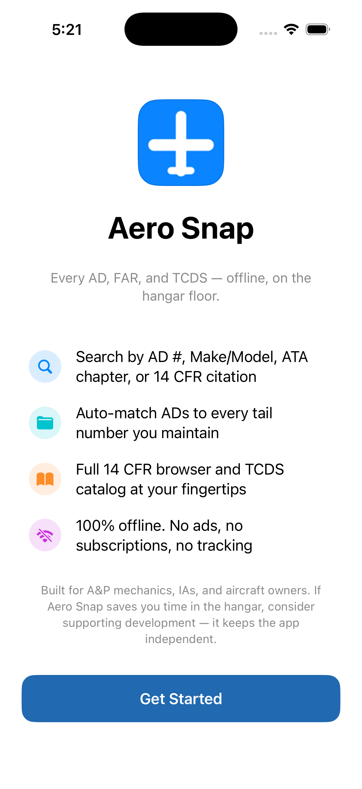

# Aero Snap

> Every FAA AD, FAR, and TCDS — offline, on the hangar floor.

iOS reference app for FAA Airworthiness Directives, 14 CFR (Federal Aviation Regulations), and Type Certificate Data Sheets. Designed for A&P mechanics, IAs, and aircraft owners who need fast, offline access to authoritative source material — without ads, accounts, or telemetry.

<p align="center">
  
</p>

## What's in the bundle

- **9,691 Airworthiness Directives** (full Federal Register modern corpus, with 4,007 older bodies dropped per the 15-year cutoff — summaries + URLs retained)
- **1,022 sections of 14 CFR** (Parts 1–199 — every section relevant to maintenance, certification, ops)
- **62 Type Certificate Data Sheets** (curated commodity GA + commercial fleet — see [`data-pipeline/TCDS_CURATION_PLAN.md`](data-pipeline/TCDS_CURATION_PLAN.md) for the 200-entry target)
- **779 Advisory Circulars** (index for quick lookup; full PDFs via "Open on Federal Register" link)
- **9,814 AD ↔ Make/Model applicability rows** for "ADs that apply to this aircraft" lookups

Total bundle: **86 MB**, comfortably under the iOS / App Store size envelope.

## Features

- **Five search modes** — AD#, Make/Model, ATA chapter, 14 CFR citation, full-text (FTS5)
- **My Aircraft** — per-tail-number folders with auto-matched ADs and compliance tracking
- **Favorites + Notes** — star ADs, attach free-text notes for shop reference
- **PDF/CSV export** — favorites and per-aircraft compliance lists, sharable via the system share sheet
- **7 themes** — System / Light / Dark free, plus 4 premium (Sky Blue, Peach Pink, Deep Charcoal, Blueberry) unlocked by the optional supporter purchase
- **Fully offline** — no network calls outside of the optional in-app purchase and user-tapped "Open on Federal Register" / "Official PDF" links

## Repository layout

```
Aero-Snap/
├── AeroSnap/                  # SwiftUI iOS app (Swift 6.0, iOS 26.5+)
│   ├── Data/
│   │   ├── Models/            # ADSummary, FARSection, TCDSummary, etc.
│   │   ├── Repository/        # actor wrapping stdlib SQLite3
│   │   └── SwiftData/         # VersionedSchema + MigrationPlan
│   ├── Views/                 # 6-tab structure
│   ├── ViewModels/            # SearchViewModel with debounce
│   ├── Managers/              # Favorites, AircraftCollections, ADNotes, Theme, Purchase
│   ├── Export/                # CSV + PDF builders
│   └── Resources/             # bundled SQLite (gitignored — regenerate via pipeline)
├── AeroSnapTests/             # Swift Testing smoke suite
├── data-pipeline/             # Python ETL — Federal Register + eCFR + curated TCDS
└── tools/                     # helper scripts (e.g. make_app_icon.py)
```

## Build

Requires Xcode 16+, [XcodeGen](https://github.com/yonaskolb/XcodeGen), and Python 3.11+ for the data pipeline.

```bash
brew install xcodegen           # if not already installed

# Generate the SQLite bundle (one time, takes ~5–10 min on a fresh clone):
cd data-pipeline
python3 build_db.py --body-cutoff-years 15 --dataset-version v1 \
    -o data/aero_snap_v1.sqlite \
    --ad data/ad_full23k.jsonl --far data/far_2026-05-30.jsonl \
    --tcds data/tcds_2026-05-31.jsonl --ac data/ac_2026-05-31.jsonl \
    --applicability data/ad_applicability_full23k.jsonl
cp data/aero_snap_v1.sqlite ../AeroSnap/Resources/

# Build the iOS app:
cd ..
xcodegen generate
open AeroSnap.xcodeproj         # Xcode 16+
# Set scheme destination to iPhone 17 simulator (Cmd-Shift-,) → Run (Cmd-R)
```

Headless run:

```bash
xcodebuild test -project AeroSnap.xcodeproj -scheme AeroSnap \
    -destination 'platform=iOS Simulator,name=iPhone 17,OS=latest'
```

## Data sources

All four datasets are works of the United States Federal Government and in the **public domain** under 17 U.S.C. § 105.

| Dataset | Source | Pipeline |
|---------|--------|----------|
| Airworthiness Directives | Federal Register API | `data-pipeline/extract_ad.py` |
| 14 CFR sections | eCFR XML API | `data-pipeline/extract_far.py` |
| Type Certificate Data Sheets | FAA TCDS PDFs (curated subset; see [DRS_RESEARCH.md](data-pipeline/DRS_RESEARCH.md) for the deferred full-scrape plan) | `data-pipeline/extract_tcds.py` + `tcds_seed.jsonl` |
| Advisory Circulars | FAA AC index | `data-pipeline/extract_ac.py` |

Body text for ADs older than 15 years is dropped from the bundle (`--body-cutoff-years 15` in `build_db.py`); the summary, applicability rows, and "Open on Federal Register" link remain so older ADs are still findable and readable on demand.

## Sister project

The desktop port lives at [`../Aero-Snap_Mac_Win_app`](../Aero-Snap_Mac_Win_app/) (currently a placeholder — scaffold scheduled after the data pipeline stabilizes).

## Privacy

[Full Privacy Policy](PRIVACY.md) — TL;DR: Aero Snap does not collect, transmit, or store any personal information. No analytics, no ads, no tracking, no account required.

The same policy is mirrored at <https://rangeareascent.github.io/Snap_Series/aerosnap/privacy/> so the App Store listing can link to a stable URL.

## License

App source: project-internal — see project repository for licensing terms. Bundled FAA/CFR datasets are US federal public-domain works, used per 17 U.S.C. § 105.

## Acknowledgments

- FAA, the Federal Register, the Office of the Federal Register, and the eCFR maintainers for making the source corpus freely accessible.
- The A&P community whose maintenance reference texts (AC 43.13-1B/2B, type-club manuals) shaped the search-mode design.
- Sibling Snap apps ([ICD Snap](https://github.com/RangeAreaScent/ICD-Snap), DOT Snap, LOINC Snap, etc.) for the shared theme system and UX patterns.
